  <source media="(prefers-color-scheme: dark)" srcset="https://readme-typing-svg.herokuapp.com?color=%23FFFFFF&size=40&center=true&width=600&height=69&lines=👋+Hi+there!+😎;✋+Welcome+To+My+Profile+😇;👨‍💻+I+love+Programming+💻;🌱+Nature+🌸;🌠+Astronomy+🌌;🧗‍♂️+Hiking+🗻;🧭+Exploring+🗺️;⌛+History+📜;🗾+Anime+🏯;📰+Research+🏆;🎼+And+create+some+Music+🎵" />
  <source media="(prefers-color-scheme: light)" srcset="https://readme-typing-svg.herokuapp.com?color=%23000000&size=40&center=true&width=600&height=69&lines=👋+Hi+there!+😎;✋+Welcome+To+My+Profile+😇;👨‍💻+I+love+Programming+💻;🌱+Nature+🌸;🌠+Astronomy+🌌;🧗‍♂️+Hiking+🗻;🧭+Exploring+🗺️;⌛+History+📜;🗾+Anime+🏯;📰+Research+🏆;🎼+And+create+some+Music+🎵" />
  
  

  
<h1>📛 Holopin Badges 🔰</h1>

  

    
  

  
<h1>📈 Github Statistic 📊</h1>

  

    
  

  
<h1>📈 Github Metrics 📊</h1>

  

    <a href="https://github.com/azharrizky">
      
      
      
      
      
      <!--  -->
      
      <!--  -->
    </a>
  

  
<h1>🐍 Snake 🐛</h1>

  

    <picture>
      <source media="(prefers-color-scheme: dark)" srcset="https://github.com/AzharRizky/AzharRizky/blob/snek-output/grid-snake-dark.svg" />
      <source media="(prefers-color-scheme: light)" srcset="https://github.com/AzharRizky/AzharRizky/blob/snek-output/grid-snake-light.svg" />
      
    </picture>
  

  
<h1>🎨 Artwork 🖼️</h1>

  

    
  

  
<h1 align="center">🎶 Listen Now 🎧</h1>

  

    
  

---

  

  <a href="https://github.com/AzharRizky/" target="_blank">
    
    
    
    
    
    <!--  -->
    <!--  -->
    <!--  -->
    <!--  -->
    
    
    
    
  </a>
  <!--
    
  
  
  
  
  -->

<!-- 
 
    
Calendar

     
        

            
        

 
    
Achievements

     
        

            
        

 -->

Updated: 2026/04/22 21:03:00 Western Indonesian Time
